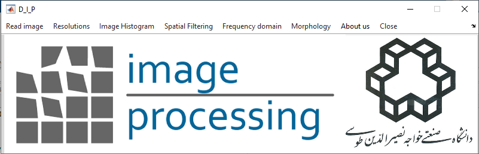

# Digital_Image_Processing

Basic Image Processing Software

This software has been developed to learn the basics of image processing.

# License

 Copyright @2017. K. N. Toosi University of Technology. All Rights Reserved. Permission to use, copy, modify, and distribute this software and its documentation for educational,  research, and not-for-profit purposes, without fee and without a signed licensing agreement, is hereby granted, provided that the above copyright notice, this paragraph and the following two paragraphs appear in all copies, modifications, and distributions.
THE SOFTWARE AND ACCOMPANYING DOCUMENTATION, IF ANY, PROVIDED HEREUNDER IS PROVIDED "AS IS". REGENTS HAS NO OBLIGATION TO PROVIDE MAINTENANCE, SUPPORT, UPDATES, ENHANCEMENTS, OR MODIFICATIONS.
This software, the “DIP educational module”, was first published in December 2017, semester 3961 of K. N. Toosi University of Technology. The software was first designed and produced as an exercise in the Digital Image Processing course under supervision of Dr. Yasser Maghsoudi and the Teacher Assistant, Seyed Ali Ahmadi. The core software was programmed by students Mr. Arash Azimi Fard & Mr. HamidReza Es'haghi. Other versions maybe released in the future through the experiences of Digital Image Processing course of the Remote Sensing Laboratory. 
For further information please contact: 

Dr. Yasser Maghsoudi : ymaghsoudi@kntu.ac.ir

  S. Ali Ahmadi ‌: cpt.ahmadisnipiol@yahoo.com

  Arash Azimi Fard : arashazimi0032@gmail.com

  HamidReza Eshaghi : hamideshaghi75@gmail.com

# Prerequisites
At least MATLAB 2017

# Usage

In order to use this software, it is enough to run D_I_P.m file

# DataSet

you can use the basic images of http://www.imageprocessingplace.com/DIP-3E/dip3e_book_images_downloads.htm for learning about image processing basics.
